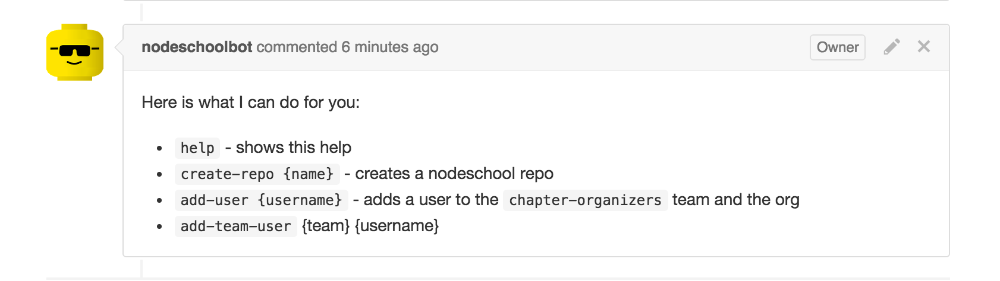

# nodeschoolbot

A github bot that helps out adding members / creating repos for [nodeschool](https://github.com/nodeschool)

We run an instance as [@nodeschoolbot](https://github.com/nodeschoolbot) on GitHub



```
npm install -g nodeschoolbot
```

[](http://travis-ci.org/mafintosh/nodeschoolbot)


## Usage

Run a command by mentioning @nodeschoolbot in an issue comment, e.g. `@nodeschoolbot help`

* `help` - shows this help
* `create-repo {name}` - creates a nodeschool repo
* `add-user {username}` - adds a user to the `chapter-organizers` team and the org
* `add-team-user {team} {username}` - add a user to a specific team

## Run one yourself

```
nodeschoolbot --token={a-github-token} --secret={a-github-webhook-secret}
```

The token passed should have access to create repositories on nodeschool
and to add members to teams.

When setting up the webhook it only needs to forward issue comments

## License

MIT
